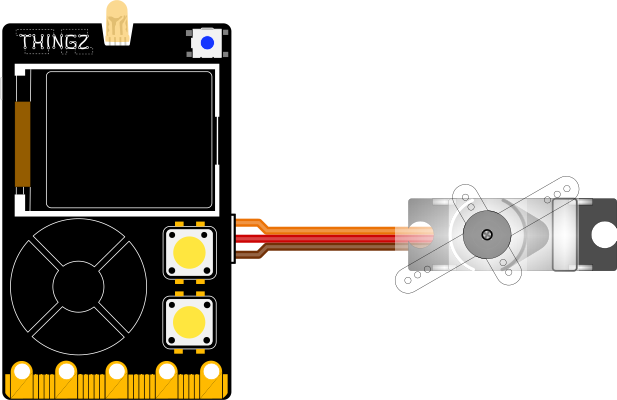

---
hide:
  - toc
---

# Contrôler un servomoteur

Permet de contrôler l'angle d'un servomoteur de 0° à 180°.


## Branchement
{: style="height:380px;"}

## Exemple

Dans l'exemple ci-dessous, nous allons placer le servomoteur (branché sur le port `Grove 1`, broche `P19` de la Galaxia) à 0° pendant une seconde puis le placer à 90° :


=== ":material-puzzle: Exemple avec des blocs"
    {: style="width:480px;"}


=== ":material-code-array: Exemple avec du code"
    ```python
    from machine import *
    import utime

    # Initialisation du servomoteur sur la broche P19
    p19 = PWM(Pin(13), freq=50, duty=205)

    # Déclaration d'une fonction qui va s'occuper de positionner
    # le servomoteur à un angle passé en paramètre
    # (si cet angle est bien compris entre 0 et 180)
    def setServoAngle(pin, angle):
    if (angle >= 0 and angle <= 180):
        pin.duty(int(0.025*1023 + (angle*0.1*1023)/180))
    else:
        raise ValueError("Attention, l'angle du servomoteur doit etre compris entre 0 et 180")

    setServoAngle(p19, 0)
    utime.sleep(1)
    setServoAngle(p19, 90)
    ```

## Aller plus loin
Dans l'exemple ci-dessus, nous utilisons la class `#!python PWM()` qui permet, entre autres, de contrôler un servomoteur. Cette classe est détaillée dans la [documentation MicroPython](https://www.micropython.fr/reference/06.ports/pi_pico/machine/PWM/classe_PWM/).