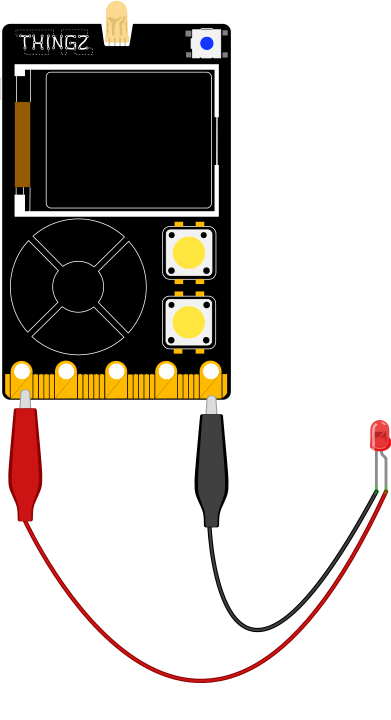
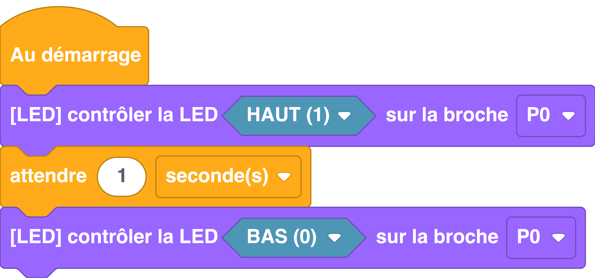

---
hide:
  - toc
---

# Contrôler une LED
Permet de contrôler l'état de la LED connectée sur une broche de la carte électronique.

## Branchement
{: style="height:380px;"}

## Exemple

Dans l'exemple ci-dessous, nous allons allumer une LED branchée sur la broche 2 pendant une seconde puis l'éteindre :

=== ":material-puzzle: Exemple avec des blocs"
    {: style="width:480px;"}

=== ":material-code-array: Exemple avec du code"

    ```python
    # On importe les modules machine et utime
    from machine import * 
    import utime

    # Déclaration d'une broche en sortie sur la broche 2
    # à l'aide du constructeur Pin()
    led = Pin(2, Pin.OUT)

    # On allume la LED
    led.on()

    # On attend 1 seconde
    utime.sleep(1)

    # On éteint la LED
    led.off()
    ```

## Aller plus loin
Dans l'exemple ci-dessus, nous utilisons la classe `#!python Pin` qui permet de manipuler les broches E/S (Entrée/Sortie) de la carte électronique. Pour en savoir plus sur cette classe, nous vous invitons à lire la [documentation MicroPython](https://www.micropython.fr/reference/#/05.micropython/machine/classe_pin).