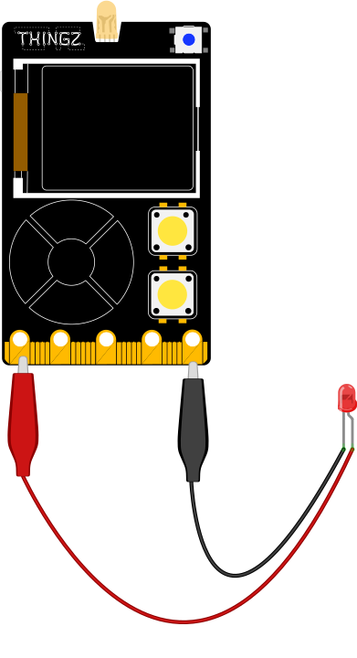

---
hide:
  - toc
---

# Régler l'intensité lumineuse d'une LED
Permet de régler la luminosité d'une LED de 0 à 100% sur les broches PWM.

## Branchement
{: style="height:380px;"}

## Exemple

Dans l'exemple ci-dessous, nous allons allumer une LED branchée sur la broche `P0` à la moitié de son intensité lumineuse maximale, nous attendrons ensuite une seconde puis on viendra l'éteindre :

=== ":material-puzzle: Exemple avec des blocs"
    {: style="width:480px;"}

=== ":material-code-array: Exemple avec du code"

    ```python
    # On importe les modules machine et utime
    from machine import *
    import utime

    # Déclaration d'une broche en sortie sur la broche P0
    # à l'aide du constructeur PWM()
    p0 = PWM(Pin(3), freq=50, duty=0)

    # On vient faire un produit en croix pour obtenir
    # 50% de la luminosité maximale
    p0.duty(int(50*1023/100))

    # On attend 1 seconde
    utime.sleep(1)

     # On éteint la LED
    p0.duty(0)
    ```

## Aller plus loin
Dans l'exemple ci-dessus, nous utilisons la classe `#!python PWM` qui permet de régler finement les broches E/S (Entrée/Sortie) de la carte électronique. Pour en savoir plus sur cette classe, nous vous invitons à lire la [documentation MicroPython](https://www.micropython.fr/reference/05.micropython/machine/classe_PWM/).