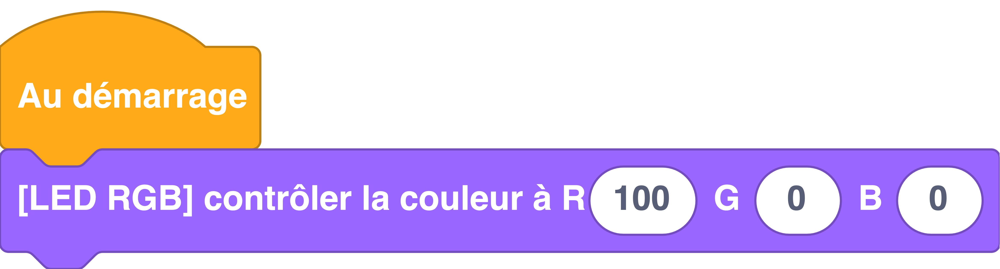

---
hide:
  - toc
---

# Contrôler la LED RVB de la Galaxia
Permet de régler l'intensité de la LED intégrée à la carte Galaxia, de 0 à 100 pour chacune des couleurs (rouge, vert, bleu).

# Branchement
{: style="height:380px;"}

## Exemple
=== ":material-puzzle: Exemple avec des blocs"

    {: style="width:480px;"}

=== ":material-code-array: Exemple avec du code"

    ```python
    # On importe le sous-module appelé led depuis le module thingz
    from thingz import led
    
    # On utilise la fonction set_colors pour allumer la LED RGB en rouge
    led.set_colors(100, 0, 0)
    ```

## Aller plus loin
Dans l'exemple ci-dessus, nous utilisons le module `#!python thingz` qui est décrit en détails [ici](../../thingz/thingz_led.md).