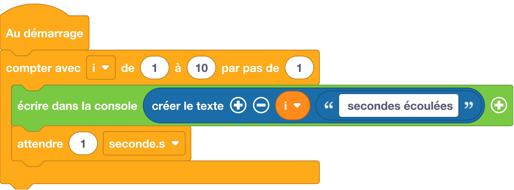

# Boucle avec variable
Faire prendre à la variable `#!python i` les valeurs depuis le nombre de début jusqu’au nombre de fin, en s’incrémentant du pas spécifié, et exécuter les instructions situées dans la boucle.

## Exemples
=== "Exemple avec des blocs"
    {: style="width:640px;"}

    !!! info

        Le bloc variable {: style="height:24px;"} peut être trouvé dans la catégorie de blocs [:fontawesome-solid-gear: Variables](#){: style="color: rgb(249, 209, 66); font-weight: bold;"}. Notez que cette variable peut être renommée en cliquant sur la petite flèche (:fontawesome-solid-caret-down:) située à côté du nom de la variable.

=== "Exemple avec du code"

    ```python
    # On importe le module utime
    import utime

    # On utilise une boucle For pour exécuter 
    # 10 fois les fonctions print() et sleep()
    for i in range(10):
      # Notez que la fonction print() peut prendre plusieurs arguments
      print(i, " secondes écoulées")
      utime.sleep(1)
    ```

## Aller plus loin
Dans l'exemple ci-dessus, nous utilisons les fonctions du langage MicroPython [`#!python print()`](../../communication/ecrire_dans_la_console.md) et `#!python range()`. Pour en savoir plus sur la fonction `#!python range()`, nous vous invitons à lire la [documentation MicroPython](https://www.micropython.fr/reference/03.builtin/range/).