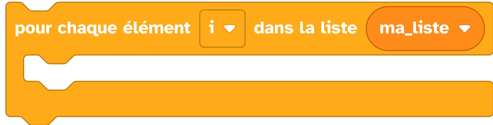

# Boucle itérative

Dans le cas de processus redondants, plutôt que d'écrire le processus de multiple fois avec des paramètres différents, il est préférable d'utiliser une boucle avec variable (`#!python for` ) ainsi qu'une ou plusieurs listes ou sont stockées toutes les variables nécessaires.
La boucle `#!python for` se charge de la structure du processus. La(les) liste(s) s'occupe(nt) des données. A chaque entrée dans la boucle on vient chercher dans la ou les listes, les paramètres du prochain cas.

## Exemples
=== "Exemple avec des blocs"
    {: style="width:640px;"}

    !!! info

        Le bloc variable {: style="height:24px;"} peut être trouvé dans la catégorie de blocs [:fontawesome-solid-gear: Variables](#){: style="color: rgb(249, 209, 66); font-weight: bold;"}. Notez que cette variable peut être renommée en cliquant sur la petite flèche (:fontawesome-solid-caret-down:) située à côté du nom de la variable.
        
        le bloc qui permet de parcourir une liste {: style="height:24px;"} se trouve sous la catégorie [:fontawesome-solid-arrow-rotate-right: Boucles](#){: style="color: rgb(34,181,115); font-weight: bold;"}.

=== "Exemple avec du code"

    ```python
    from machine import *
    import utime

    # Servo on p26
    d2 = PWM(Pin(26), freq=50, duty=0)

    #  on créer une fonction pour calculer le duty et l'appliquer au servomoteur, à partir d'un angle donné.
    def setServoAngle(pin, angle):
        if (angle >= 0 and angle <= 180):
            pin.duty(int(0.025*1023 + (angle*0.1*1023)/180))
        else:
            raise ValueError("Servomotor angle have to be set between 0 and 180")
    # on défini une liste d'angle
    angles = [10, 90, 30]

    while True:
    #pour chaque angle de la liste angles on applique la fonction créer précédemment
    for i in angles:
        setServoAngle(d2, i)
        utime.sleep(5)
    ```

## Aller plus loin
Dans l'exemple ci-dessus, nous utilisons les fonctions du langage MicroPython [`#!python def`](../fonctions/fonction.md), `#!python for` et `#!python if else`.

Pour en savoir plus sur  `#!python def`, nous vous invitons à lire la [documentation MicroPython](https://www.micropython.fr/reference/#/02.mots_cles/def?id=def).

Pour en savoir plus sur  `#!python for in`, nous vous invitons à lire la [documentation MicroPython](https://www.micropython.fr/reference/#/02.mots_cles/for_in?id=for-in-).

Pour en savoir plus sur  `#!python if else`, nous vous invitons à lire la [documentation MicroPython](https://www.micropython.fr/reference/#/02.mots_cles/if_elif_else?id=if-elif-else-).