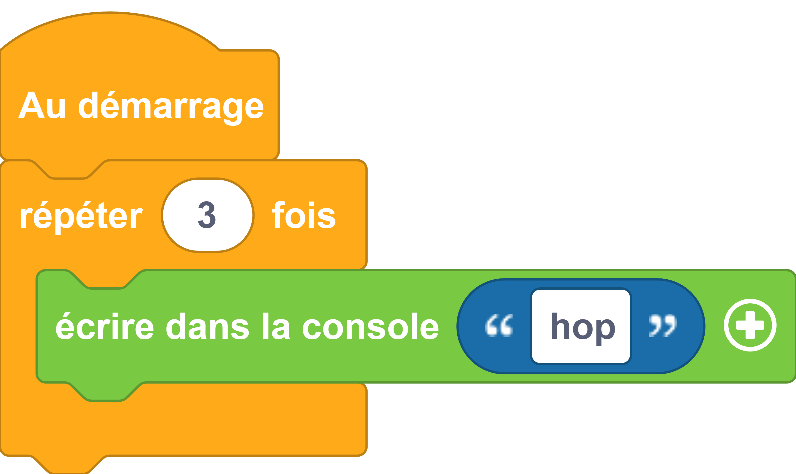

# Boucle simple
Éxécuter des instructions plusieurs fois.

## Exemple avec des blocs
{: style="width:480px;"}

## Exemple avec du code

```python
# On utilise une boucle For pour exécuter
# 3 fois la fonction print()
for count in range(3):
  print('toc !');
```

## Aller plus loin
Dans l'exemple ci-dessus, nous utilisons les fonctions du langage MicroPython [`#!python print()`](../../communication/ecrire_dans_la_console.md) et `#!python range()`. Pour en savoir plus sur la fonction `#!python range()`, nous vous invitons à lire la [documentation MicroPython](https://www.micropython.fr/reference/03.builtin/range/).