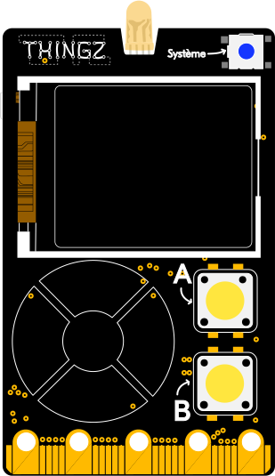

---
hide:
  - toc
---

# Détecter l'appui sur un bouton
Faire quelque chose quand un bouton est maintenu appuyé.

!!! info

    Le bouton devra être maintenu appuyé au moment où celui-ci est testé. Si vous souhaitez détecter l'appui d'un bouton dès qu'on le relâche, cela se passe par [ici](bouton_avec_interruption.md).

## Branchement
{: style="height:380px;"}

## Exemple

Dans l'exemple ci-dessous, nous allons afficher un message lorsque l'un des boutons de la Galaxia est appuyé ou touché :

=== ":material-puzzle: Exemple avec des blocs"
    {: style="width:480px;"}

=== ":material-code-array: Exemple avec du code"

    ```python
    # On importe les modules dont on a besoin
    from thingz import *

    # On vient tester s'il y a eu un appui
    while True:
      if button_a.is_pressed():
        print('Bouton A appuyé !')
      if button_a.is_pressed():
        print('Bouton B appuyé !')
      if touch_n.is_touched():
        print('Bouton tactile haut touché !')
      if touch_s.is_touched():
        print('Bouton tactile bas touché !')
      if touch_e.is_touched():
        print('Bouton tactile droit touché !')
      if touch_w.is_touched():
        print('Bouton tactile gauche touché !')
    ```

## Aller plus loin
Dans l'exemple ci-dessus, nous utilisons le module `#!python thingz` qui est décrit en détails [ici](../thingz/thingz.md).