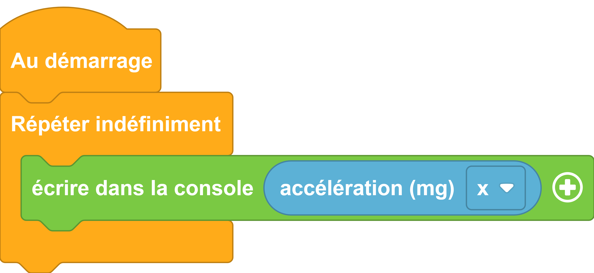

---
hide:
  - toc
---
# Accéléromètre

Un accéléromètre est intégré à la  galaxia. Il permet de capter l'accélération de la carte suivant les différents axes ou la force d'un choc.
Mesurer l'accélération permet de calculer la vitesse, le déplacement, les chocs et les vibrations de la carte

## Exemple

=== ":material-puzzle: Exemple avec des blocs"
    {: style="width:480px;"}
    [ouvrir dans vittascience](https://fr.vittascience.com/galaxia/?link=645e2e1ac5860&toolbox=scratch&mode=blocks&embed=1)

=== ":material-code-array: Exemple avec du code"

``` python
from machine import *
from thingz import *

while True:
  print(str(accelerometer.get_x()));

```

    
## Aller plus loin

Dans l'exemple ci-dessus, nous utilisons la classe `#!python Pin` qui permet de manipuler les broches E/S (Entrée/Sortie) de la carte électronique. Pour en savoir plus sur cette classe, nous vous invitons à lire la [documentation MicroPython](https://docs.micropython.org/en/latest/library/machine.Pin.html?highlight=analog#machine.Pin.ANALOG).

Nous utilisons aussi `#!python str()`, nous vous invitons à lire la [documentation MicroPython](https://www.micropython.fr/reference/03.builtin/str/).

et enfin la librairie thingz avec [sa bibliothèque adaptée à l'accéléromètre](../thingz/thingz_accelerometer.md)

Pour en savoir plus sur les accéléromètres.

[la page wikipédia](https://fr.wikipedia.org/wiki/Acc%C3%A9l%C3%A9rom%C3%A8tre)

[Université de Bordeaux](https://www.youtube.com/watch?v=QUEH9ZUrxEU)

