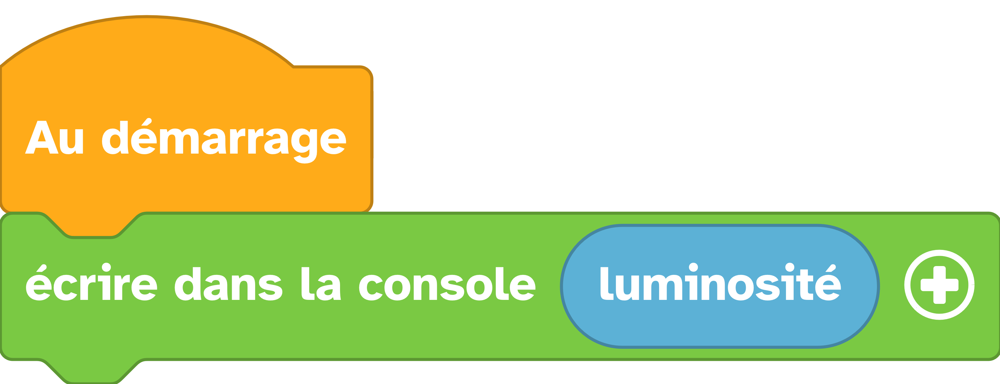

---
hide:
  - toc
---

# Mesurer la luminosité

Permet de mesurer la luminosité ambiante.

## Exemple

=== ":material-puzzle: Exemple avec des blocs"
    {: style="width:480px;"}

=== ":material-code-array: Exemple avec du code"

    ```python
    # On importe le module thingz qui dispose d'un objet led
    from thingz import *

    # On affiche la valeur de la luminosité
    print(led.read_light_level())
    ```

    
## Aller plus loin

Dans l'exemple ci-dessus, nous utilisons le module `#!python thingz` qui est décrit en détails [ici](../thingz/thingz.md).
