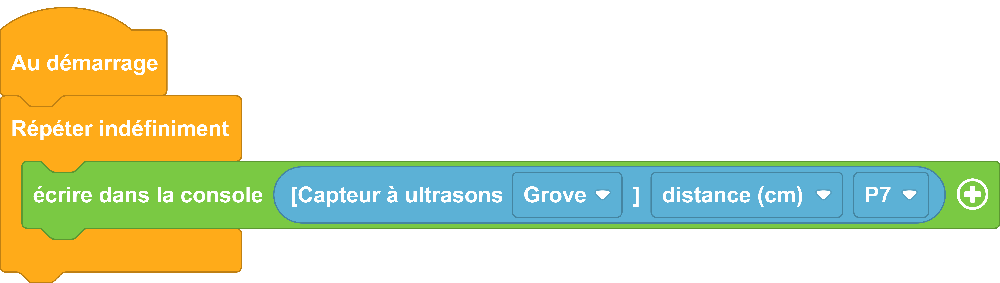

---
hide:
  - toc
---
# Capteur à Ultrason

Le capteur à ultrason fonctionne comme son nom l'indique à l'aide d'ultrason.
il est réalisé avec un module émetteur d'ultrason et un module capteur d'ultrason

Le temps mis pour l'onde ultrasonore pour faire l'aller retour, capteur obstacle, donne la distance à laquelle se trouve celui-ci.


## Exemple
=== ":material-puzzle: Exemple avec des blocs"
    {: style="width:480px;"}
    [ouvrir dans vittascience](https://fr.vittascience.com/galaxia/?link=645e439bbe4f0&mode=blocks&embed=1)

=== ":material-code-array: Exemple avec du code"

  ```python
  
  from machine import *
  from thingz import *
  import utime

  # Ultrasonic on p7
  # définition de la fonction pour extraire la distance du capteur
  def grove_getUltrasonicData(pinNumber, data='distance', timeout_us=30000):
    trig = Pin(pinNumber, Pin.OUT)
    trig.off()
    utime.sleep_us(2)
    trig.on()
    utime.sleep_us(10)
    trig.off()
    echo = Pin(pinNumber, Pin.IN)
    duration = time_pulse_us(echo, 1, timeout_us)/1e6 # t_echo in seconds
    if duration > 0:
      if data == 'distance':
        #sound speed, round-trip/2, get in cm
        return 343 * duration/2 * 100
      elif data == 'duration':
        return duration
      else:
        raise ValueError("Data option '" + data + "' is not valid")
    else:
      return -1

  while True:
  # impression de la distance calculée par le capteur branché broche 7
    print(str(grove_getUltrasonicData(7, data='distance')));

  ```

    
## Aller plus loin

Dans l'exemple ci-dessus, nous utilisons la classe `#!python Pin` qui permet de manipuler les broches E/S (Entrée/Sortie) de la carte électronique. Pour en savoir plus sur cette classe, nous vous invitons à lire la [documentation MicroPython](https://www.micropython.fr/reference/#/05.micropython/machine/classe_pin).

Nous utilisons aussi `#!python str()`, nous vous invitons à lire la [documentation MicroPython](https://www.micropython.fr/reference/#/03.modules_standards/str/).
