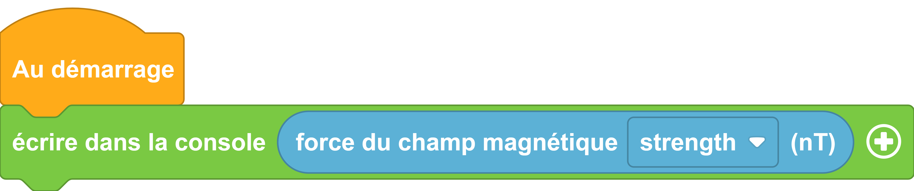

---
hide:
  - toc
---
# Magnétomètre

Ce capteur permet de mesurer un champ magnétique dans un espace en 3 dimensions. L'usage qui nous intéressera le plus souvent est la détection du nord magnétique. Ainsi, vous pourrez programmer votre carte comme une boussole ou trouvez votre orientation par rapport au nord.

## Exemple

=== ":material-puzzle: Exemple avec des blocs"
    {: style="width:480px;"}
    [ouvrir dans vittascience](https://fr.vittascience.com/galaxia/?link=645e2e1ac5860&toolbox=scratch&mode=blocks&embed=1)

=== ":material-code-array: Exemple avec du code"

    ``` python
        from machine import *
        from thingz import *
        import math

        print(str(math.sqrt((compass.get_x() ** 2 + compass.get_y() ** 2) + compass.get_z() ** 2)));

    ```
    !!! info
            on remarque que dans ce code une opération mathématique est réalisée. On prend la racine carrée de la somme des carrées de chaque composante. Pour avoir la "norme" résultante. [si vraiment vous voulez vous rappeler vos cours du collège](https://query.libretexts.org/Francais/Livre_%3A_Calculus_(OpenStax)/12%3A_Vecteurs_dans_l'espace/12.02%3A_Vecteurs_en_trois_dimensions) 
         
    
## Aller plus loin

Dans l'exemple ci-dessus, nous utilisons la classe `#!python math` qui permet d'incorporer des outils mathématiques dans le programme'. Pour en savoir plus sur cette classe, nous vous invitons à lire la [documentation MicroPython](https://docs-micropython-org.translate.goog/en/latest/library/math.html?_x_tr_sl=ja&_x_tr_tl=fr&_x_tr_hl=fr&_x_tr_pto=wapp).

Nous utilisons aussi `#!python str()`, nous vous invitons à lire la [documentation MicroPython](https://www.micropython.fr/reference/#/03.modules_standards/str/).

et enfin la librairie thingz avec [sa bibliothèque adaptée au magnétomètre](../thingz/thingz_compass.md)

Pour en savoir plus sur les magnétomètres.

[la page wikipédia](https://fr.wikipedia.org/wiki/Magn%C3%A9tom%C3%A8tre)


