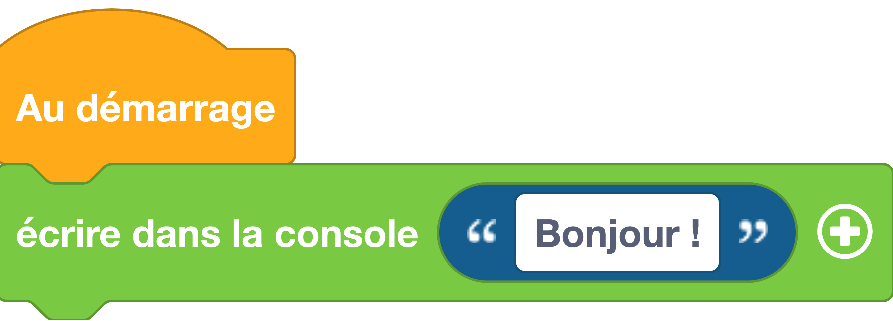

---
hide:
  - toc
---

# Écrire dans la console
Permet d'écrire des données dans le port série (appelé également _console_ ou encore _REPL_). Le port série permet d'échanger des données entre la carte Galaxia et l'ordinateur grâce à la liaison USB. Lorsque vous utilisez l'interface Vittascience, vous pouvez voir les données reçues de la carte (ou du simulateur) grâce au bouton [:fontawesome-solid-terminal: REPL](#){ .btn-light style='color:black;' } situé en bas de l'interface .

## Exemple
=== ":material-puzzle: Exemple avec des blocs"
    {: style="width:420px;"}

=== ":material-code-array: Exemple avec du code"

    ```python
    # print() fait partie du langage MicroPython
    # pas besoin d'importer un module

    # Affichage d'un message avec la fonction print()
    print("Bonjour !")
    ```

## Aller plus loin
Dans l'exemple ci-dessus, nous utilisons la fonction `#!python print()` qui fait partie du langage MicroPython (donc pas besoin d'importer un module pour l'utiliser). Cette fonction peut prendre un ou plusieurs paramètres détaillés dans la [documentation MicroPython](https://www.micropython.fr/reference/03.builtin/print/).