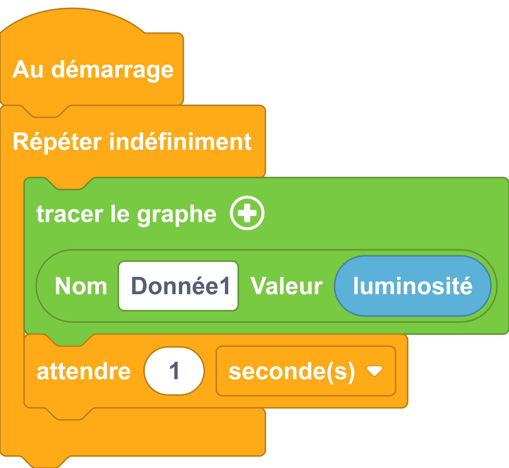

---
hide:
  - toc
---

# Tracer le graphe
Permet de diriger des données vers le mode graphique de la console de Vittascience.
Chaque valeur traitée par ce bloc aura sa place dans un graphique dont l'ordonné sera la valeur elle-même et l'abside sera le temps auquel cette valeur sera reçue.
la taille du graphe augmente avec le temps et s'adapte aux valeurs qu'il reçoit.

## Exemple
=== ":material-puzzle: Exemple avec des blocs"
    {: style="width:420px;"}

=== ":material-code-array: Exemple avec du code"

    ```python
        from machine import *
        from thingz import *
        import utime

        while True:
        print('@Graph:Donnée1:' + str(led.read_light_level()) + '|')
        utime.sleep_ms(50)
        utime.sleep(1)

            ```

## Aller plus loin
Ce mode dépend de l'interface que vous utilisez et si celui-ci le propose. il est interessant de visualiser rapidement ce que donnerais une représentation graphique avec d'autres outils
Dans l'exemple ci-dessus, nous utilisons la fonction `#!python print()` qui fait partie du langage MicroPython (donc pas besoin d'importer un module pour l'utiliser). Cette fonction peut prendre un ou plusieurs paramètres détaillés dans la [documentation MicroPython](https://www.micropython.fr/reference/#/03.builtin/print).