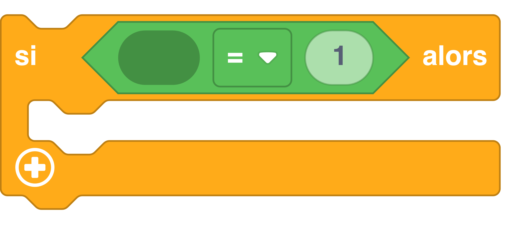

## Exécuter des instructions selon des conditions

On peut controler le déroulement du programme selon des conditions.

Dans l'exemple ci-dessous, nous allons modifier l'état d'une LED RVB,

- En Vert si le bouton A seul est appuyé.
- En orange si le bouton B seul est appuyé.
- En rouge si les boutons A et B sont tous les deux appuyés.
- Eteinte si aucun des boutons est appuyé.

=== ":material-puzzle: Exemple avec des blocs"
    {: style="width:380px;"}

	!!! info
    	Le bloc "si" `#!python if` {: style="height:24px;"} peut être trouvé dans la catégorie de blocs [:fontawesome-solid-gear: Contrôle](#){: style="color: rgb(252,116,23); font-weight: bold;"}.
		
		 Notez qu'une condition doit être fournie pour que ce bloc soit fonctionnel.


=== ":material-code-array: Exemple avec du code"

	```python
	# On boucle indéfiniment
	while True:
	     # si le bouton A seul est appuyé
	     if button_a.is_pressed() and not button_b.is_pressed():
	     # on allume la led de couleur verte
	     	led.set_colors(0, 255, 0)
	     # si le bouton B seul est appuyé
	     elif not button_a.is_pressed() and button_b.is_pressed():
         # on allume la led de couleur orange
	     	led.set_colors(255, 140, 0)
	     # si le bouton A et le bouton B sont appuyés
	     elif button_a.is_pressed() and button_b.is_pressed():
	     # on allume la led de couleur rouge
	     	led.set_colors(255, 0, 0)
	     else:
	     # on garde chaque canaux de la led à zero (intensité nulle)
	     	led.set_colors(0, 0, 0)	
	```

	Si la partie entre `#!python if` et les `#!python :` est évaluée comme vrai alors les instructions indentées qui suivent les `#!python :` seront exécutées.	Sinon ce sont les instructions situées après le `#!python else:` qui le seront.

## Aller plus loin

On a souvent l'habitude de représenter le cours du programme avec un organigramme de programmation :


Si vous voulez en savoir plus sur les organigrammes, voici une chouette page [Wikipédia](https://fr.wikipedia.org/wiki/Organigramme_de_programmation).
Dans l'exemple ci-dessus, nous utilisons les fonctions du langage MicroPython `#!python if` et `#!python else`. Pour en savoir plus, nous vous invitons à lire la [documentation MicroPython](https://www.micropython.fr/reference/02.mots_cles/if_elif_else/).

