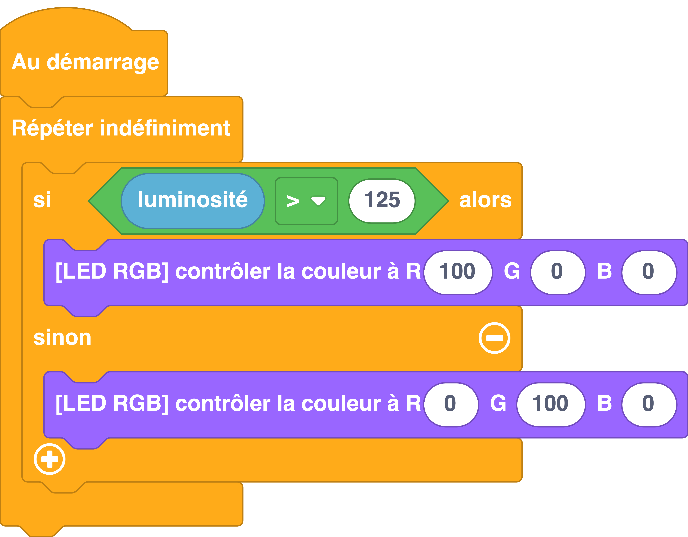
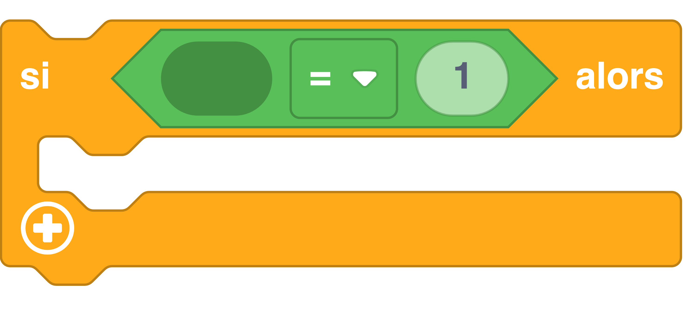
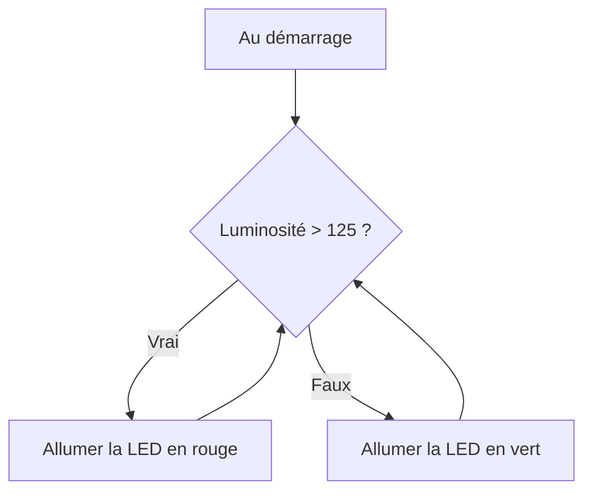

---
hide:
  - toc
---

# Exécuter des instructions si une condition est vraie ou non

Permet d'exécuter des instructions si une condition est vraie.

Dans l'exemple ci-dessous, nous allons allumer la LED RGB de la Galaxia en rouge si le seuil de luminosité est supérieur à un certain seuil (125), sinon la LED est allumée en vert.

=== ":material-puzzle: Exemple avec des blocs"
    {: style="width:380px;"}

	!!! info
    	Le bloc `#!python if` {: style="height:24px;"} peut être trouvé dans la catégorie de blocs [:fontawesome-solid-code-branch: Contrôle](#){: style="color: rgb(255, 171, 25); font-weight: bold;"}. Notez qu'une condition issue de la catégorie de bloc [:fontawesome-solid-calculator: Opérateurs](#){: style="color: rgb(89, 192, 89); font-weight: bold;"} doit être fournie pour que ce bloc soit fonctionnel.

=== ":material-code-array: Exemple avec du code"

	```python

	# On boucle indéfiniment
	while True:  
		# Si le niveau de luminosité relevé par le capteur est supérieur à 125
		if led.read_light_level() > 125:
			# Alors on allume la LED RVB en rouge
			led.set_colors(255, 0, 0)
		else:
			# Sinon on allume la LED RVB en vert
			led.set_colors(0, 255, 0)
	```

	Si la partie entre `#!python if` et les `#!python :` est évaluée comme vrai alors les instructions indentées qui suivent les `#!python :` seront exécutées.	Sinon ce sont les instructions situées après le `#!python else:` qui le seront.


## Aller plus loin
Pour se représenter le programme précédent, on peut s'aider d'un organigramme : 



Si vous voulez en savoir plus sur les organigrammes, voici une chouette page [Wikipédia](https://fr.wikipedia.org/wiki/Organigramme_de_programmation).
Dans l'exemple ci-dessus, nous utilisons les fonctions du langage MicroPython `#!python if` et `#!python else`. Pour en savoir plus, nous vous invitons à lire la [documentation MicroPython](https://www.micropython.fr/reference/02.mots_cles/if_elif_else/).

