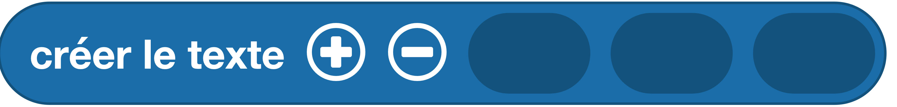

---
hide:
  - toc
---

# Utiliser le chronomètre
Récupérer le nombre de millisecondes écoulées depuis le lancement de la carte.

## Exemple
=== ":material-puzzle: Exemple avec des blocs"
    
    {: style="width:740px;"}

    !!! info
        Le bloc {: style="height:24px;"} permet d'agréger (on dit aussi concaténer) des éléments (variables, chaînes de caractères...) pour former un nouveau texte. Ce bloc peut être trouvé dans la catégorie de blocs [:fontawesome-solid-font: Texte](#){: style="color: rgb(26, 109, 168); font-weight: bold;"}.
        Le bloc {: style="height:24px;"} permet d'arrondir un nombre flottant. Ce bloc peut être trouvé dans la catégorie de blocs [:fontawesome-solid-calculator: Math](#){: style="color: rgb(63, 169, 245); font-weight: bold;"}.

=== ":material-code-array: Exemple avec du code"

    ```python
    # On importe le module utime (pour ticks_ms et ticks_diff)
    import utime
    # On importe le module math (pour la fonction round)
    import math

    # On vient stocker le temps de début
    debut = utime.ticks_ms()

    # On répète indéfiniment
    while True:
        # On affiche la différence de temps entre maintenant et le début
        print(round(utime.ticks_diff(utime.ticks_ms(), debut)/1000), " secondes")
        
        # On attend 1 seconde
        utime.sleep(1)
    ```

## Aller plus loin
Dans l'exemple ci-dessus, nous utilisons le module `#!python utime` qui permet de gérer les éléments de temps. Pour en savoir plus sur cette classe, nous vous invitons à lire la [documentation MicroPython](https://www.micropython.fr/reference/#/04.modules_standards/utime/00.module_time?id=module-utime).