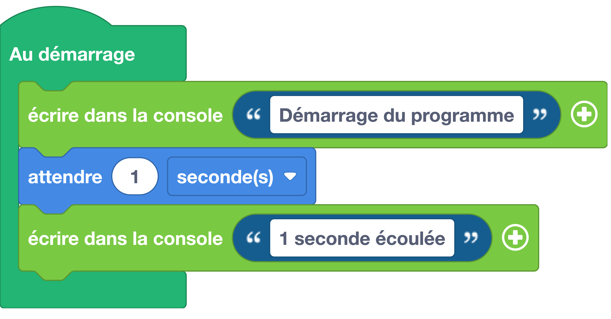

# Attendre
Effectue une pause dans l'exécution du code.

## Exemple avec des blocs
{: style="width:480px;"}

## Exemple du code

```python
# On importe le module utime
import utime

# Affichage d'un message avec la fonction print()
print("Démarrage du programme")

# On attend 1 seconde
utime.sleep(1)

print("1 seconde écoulée")
```

## Aller plus loin
Dans l'exemple ci-dessus, nous utilisons le module `utime` qui permet de gérer les éléments de temps. Pour en savoir plus sur cette classe, nous vous invitons à lire la [documentation MicroPython](https://www.micropython.fr/reference/04.standards/utime/00.module_time/).