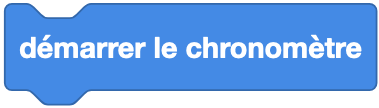

Initialise un chronomètre à 0 (en secondes).

# Bloc
{: style="height:64px;"}

# Code

## Exemple : Affichage différé

```python
# On importe le module utime
import utime

# Affichage d'un message avec la fonction print()
print("Démarrage du programme")

# On attend 1 seconde
utime.sleep(1)

print("1 seconde écoulée")
```
## Documentation MicroPython
Dans l'exemple ci-dessus, nous utilisons le module `utime` qui permet de gérer les éléments de temps. Pour en savoir plus sur cette classe, nous vous invitons à lire la [documentation MicroPython](https://www.micropython.fr/reference/04.standards/utime/00.module_time/).