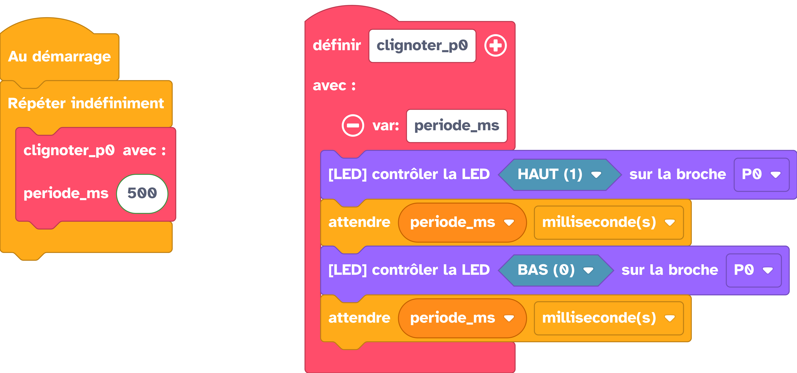
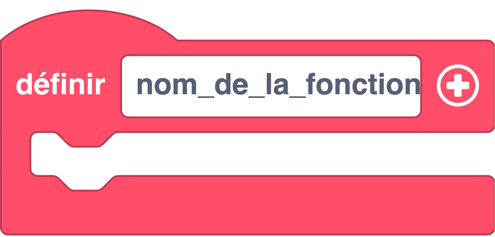

---
hide:
  - toc
---

# Définir une fonction

Rendre une partie de programme accessible par son nom en lui passant tout ce qui lui est nécessaire pour fonctionner.

Les variables déclarées dans la fonction ne sont valable qu'en local dans la fonction (on parle de la portée d'une variable). De plus, dans une fonction, les variables globales ne sont disponibles qu'en lecture.

## Exemple

=== ":material-puzzle: Exemple avec des blocs"
    {: style="width:480px;"}


    !!! info

        Les blocs pour définir une fonction {: style="height:24px;"} peuvent être trouvés dans la catégorie de blocs [:material-function-variant: Fonctions](#){: style="color: rgb(255, 77, 106); font-weight: bold;"}. 

        On ajoute le nombre de paramètres nécessaires avec le :octicons-plus-circle-16:. et on nomme ces paramètres avec les champs prévus à cet effet.

        Notez que dans cette catégorie il existe deux types de blocs. Des blocs pour les fonctions qui peuvent renvoyer un résultat (ces fonctions sont appelées "fonctions avec sortie"). D'autres qui ne renvoient rien, appelées "fonctions sans sortie".

=== ":material-code-array: Exemple avec du code"

    ```python
    from machine import *
    import utime

    # Initialisation d'une LED branchée entre P0 et GND
    p0 = Pin(3, Pin.OUT)

    # Déclaration d'une fonction appelée "clignoter_p0"
    def clignoter_p0(periode_ms):
        # On allume la LED
        p0.on()
        # On attend le nombre de ms passé en paramètre 
        utime.sleep_ms(periode_ms)
        # On éteint la LED
        p0.off()
        # On attend le nombre de ms passé en paramètre 
        utime.sleep_ms(periode_ms)

    while True:
        # On appelle la fonction que l'on vient de déclarer
        clignoter_p0(500)
    ```

## Aller plus loin

Dans l'exemple ci-dessus, nous utilisons la classe `#!python def` qui permet de définir une fonction. Pour en savoir plus sur cette classe, nous vous invitons à lire la [documentation MicroPython](https://www.micropython.fr/reference/#/02.mots_cles/def/). Nous faisons également référence à la portée d'une variable, pour en savoir plus sur cette notion, tout est sur la [documentation Micropython](https://www.micropython.fr/reference/#/02.mots_cles/global/#portee-de-la-variable-definition).