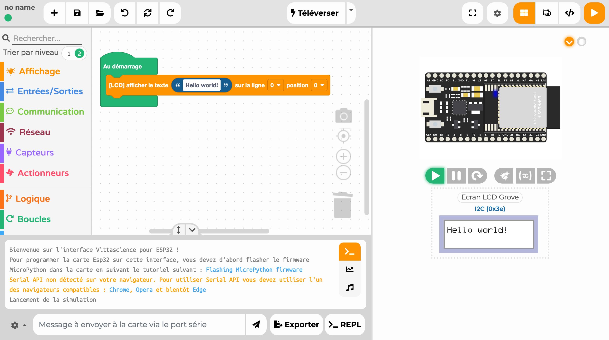

---
hide:
  - toc
---

# Interface Vittascience

L'interface de programmation Vittascience permet de programmer [la carte électronique Galaxia](galaxia.md) depuis votre navigateur web en assemblant visuellement des blocs comme un puzzle. Ces blocs vont ensuite générer automatiquement un code MicroPython compréhensible par la carte.

!!! info
    Veuillez notez qu'il est également possible de se passer des blocs et utiliser l'interface en [mode code](#mode-code) uniquement en cliquant sur le bouton [:fontawesome-solid-code:](#){ .btn-light style='color:black;' } dans la barre du haut.

# TODO Remplacer l'image ci-dessus par une vidéo lorsque l'interface sera mature