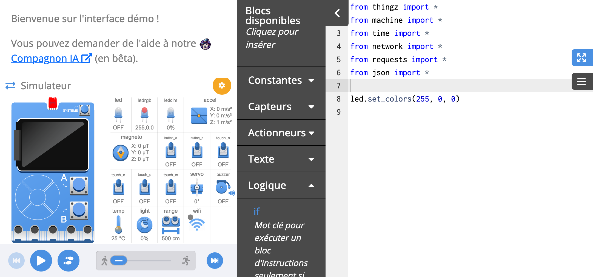

---
hide:
  - toc
---

# Interface France-IOI

L'interface de programmation France-IOI permet de programmer et de simuler [la carte électronique Galaxia](galaxia.md) depuis votre navigateur web. Pour accéder à cette interface, rendez-vous sur l'onglet **Interface France-IOI** dans le MOOC ou directement sur [ce lien](https://static-items.algorea.org/files/checkouts/9615a6818698411aafd48449bfbecfb0/galaxia-test/index_codecast.html).

