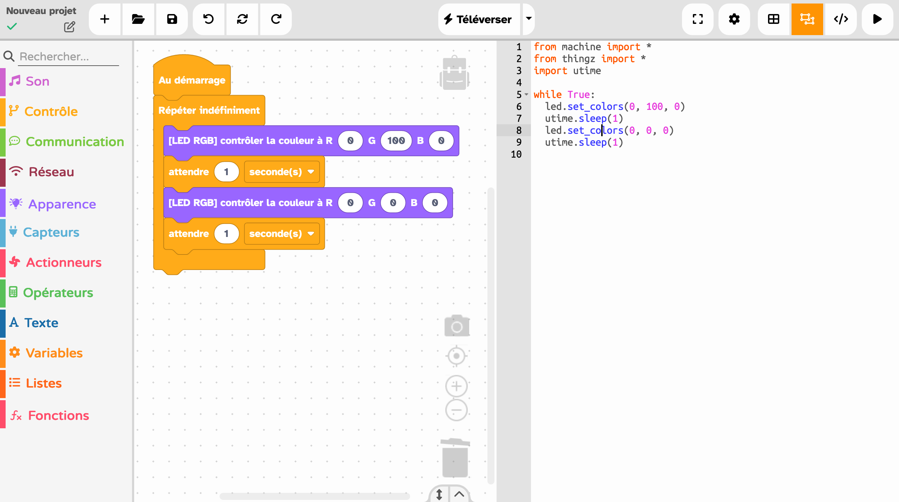

---
hide:
  - toc
---

# Interface Vittascience

L'interface de programmation Vittascience permet de programmer [la carte électronique Galaxia](galaxia.md) depuis votre navigateur web en assemblant visuellement des blocs comme un puzzle. Ces blocs vont ensuite générer automatiquement un code MicroPython compréhensible par la carte. Pour accéder à cette interface, rendez-vous sur l'onglet **Interface Vittascience** dans le MOOC ou directement à [lien](https://fr.vittascience.com/galaxia/?mode=mixed&console=bottom&toolbox=scratch&embed=1).

## Accessibilité
L'équipe Vittascience travaille continuellement à améliorer le niveau d'accessibilité du site Vittascience et sa conformité avec les normes en la matière. Pour plus d'informations, veuillez consulter [cette page](https://fr.vittascience.com/accessibility).