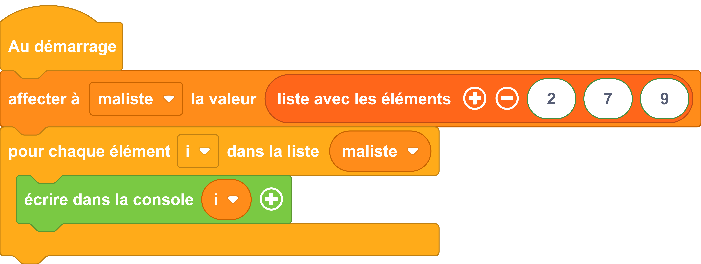

---
hide:
  - toc
---

# Créer une liste

Une liste est une structure de données qui permet de stocker et d'organiser plusieurs éléments de manière séquentielle. Elle peut contenir des valeurs de différents types, telles que des nombres, des textes, des nombres flottants, des booléens, voire même d'autres listes.


## Exemples 1
=== ":material-puzzle: Exemple avec des blocs"
    {: style="width:640px;"}

    !!! info

        Le bloc variable {: style="height:24px;"} et le bloc d'affectation peuvent être trouvés dans la catégorie de blocs [:fontawesome-solid-gear: Variables](#){: style="color: rgb(255, 140, 26); font-weight: bold;"}. Notez qu'une variable peut être renommée en cliquant sur la petite flèche (:fontawesome-solid-caret-down:) située à côté du nom de la variable.

        Le bloc qui permet de parcourir une liste {: style="height:24px;"} se trouve dans la catégorie de blocs [:fontawesome-solid-code-branch: Contrôle](#){: style="color: rgb(255, 171, 25); font-weight: bold;"}.
        
        Le bloc pour affecter des éléments à une liste {: style="height:24px;"} se trouve dans la catégorie de blocs [:fontawesome-solid-list: Listes](#){: style="color: rgb(255, 102, 26); font-weight: bold;"}.


=== ":material-code-array: Exemple avec du code"

    ```python
    from machine import *
    from thingz import *
    # on créé une liste nommée maliste
    maliste = [2, 7, 9]
    # pour chaque élément de la liste maliste
    for i in maliste:
        # je prend l'élément et lui applique la fonction str() pour en faire une
        # chaîne de caractères afin de l'afficher
        print(str(i))
    ```


## Exemple 2

=== ":material-puzzle: Exemple avec des blocs"
    {: style="width:640px;"}

   


=== ":material-code-array: Exemple avec du code"

    ```python
    from machine import *
    from thingz import *
    import utime

    maliste = []

    while True:
        maliste.append(led.read_light_level())
        utime.sleep(180)
    ```


## Aller plus loin

Les opérations sur les listes sont aussi nombreuses que pratiques. Vous pourrez vous faire une idée rapide de ce qu'il est possible de faire sur le site [python.doctor](https://python.doctor/page-apprendre-listes-list-tableaux-tableaux-liste-array-python-cours-debutant). Ou si vous préférez un petit film, choisissez [les Pythonnerie sur les listes](https://www.youtube.com/watch?v=J3RJE8516MU).

Dans l'exemple ci-dessus, nous utilisons les fonctions du langage MicroPython [`#!python print()`](../communication/ecrire_dans_la_console.md) et `#!python str()` toutes deux détaillés dans la [documentation MicroPython](https://www.micropython.fr/reference/#/03.builtin/print). Nous utilisons une [boucle itérative](../boucles/boucle_iterative.md) et pour en savoir plus la aussi : la [documentation MicroPython](https://www.micropython.fr/reference/#/02.mots_cles/for_in/)