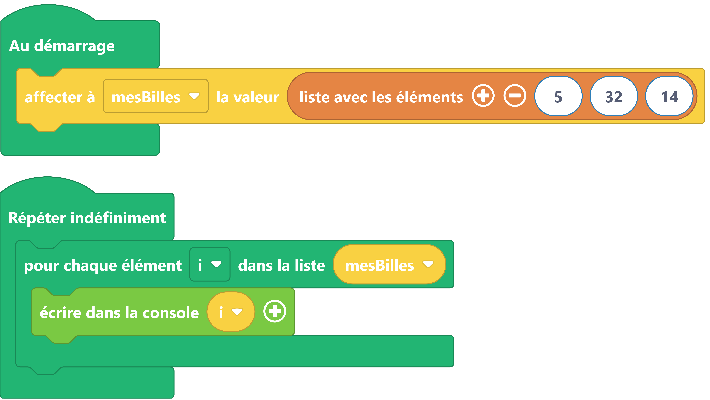

# Liste avec éléments

Utiliser une liste pour stocker une suite d'éléments.
Pour profiter de tous les outils des listes pour gérer ces éléments.

## Exemples
=== "Exemple avec des blocs"
    {: style="width:640px;"}

    !!! info

        Le bloc variable {: style="height:24px;"} peut être trouvé dans la catégorie de blocs [:fontawesome-solid-gear: Variables](#){: style="color: rgb(249, 209, 66); font-weight: bold;"}. Notez que cette variable peut être renommée en cliquant sur la petite flèche (:fontawesome-solid-caret-down:) située à côté du nom de la variable.

        Le bloc qui permet de parcourir une liste {: style="height:24px;"} se trouve sous la catégorie [:fontawesome-solid-arrow-rotate-right: Boucles](#){: style="color: rgb(34,181,115); font-weight: bold;"}.
        
        Le bloc pour affecter des éléments à une liste {: style="height:24px;"} se trouve dans la catégorie de blocs [:fontawesome-solid-list: Listes](#){: style="color: rgb(229,133,68); font-weight: bold;"}.

        Le bloc pour affecter une liste a une variable {: style="height:24px;"} lui se trouve dans la catégorie[:fontawesome-solid-gear: Variables](#){: style="color: rgb(249, 209, 66); font-weight: bold;"}.


=== "Exemple avec du code"

    ```python
    # on créer une liste nommée bille    
    mesBilles = [5, 32, 14]

    while True:
      for i in mesBilles:
        print(str(i));

    ```


## Aller plus loin

Les opérations sur les listes sont aussi nombreuses que pratique je vous propose d'aller faire un tour sur [python.doctor](https://python.doctor/page-apprendre-listes-list-tableaux-tableaux-liste-array-python-cours-debutant) juste pour avoir une idée rapide de ce qu'il est possible de faire.

Dans l'exemple ci-dessus, nous utilisons les fonctions du langage MicroPython [`#!python print()`](../communication/ecrire_dans_la_console.md) et `#!python str()`.
La fonction `#!python print()` est détaillés dans la [documentation MicroPython](https://www.micropython.fr/reference/#/03.builtin/print).

Pour en savoir plus sur la fonction `#!python str()`, nous vous invitons à lire la [documentation MicroPython](https://www.micropython.fr/reference/#/03.classes_builtins/README?id=class-str).

Nous utilisons une [boucle itérative](../boucles/boucle_iterative.md) et pour en savoir plus la aussi : la [documentation MicroPython](https://www.micropython.fr/reference/#/02.mots_cles/for_in/)