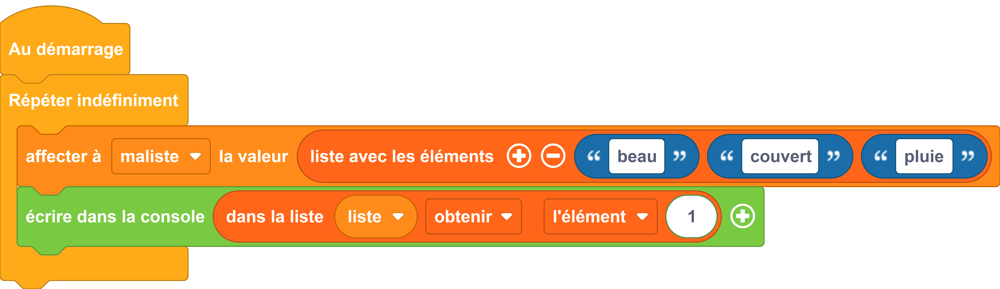

# Obtenir l'élément d'une liste

## Un autre exemple

=== "Exemple avec des blocs"
    {: style="width:640px;"}


=== "Exemple avec du code"

    ```python
    from machine import *
    from thingz import *
    while True:
        # on créer une liste nommée maliste 
        maliste = [2, 7, 9]
        # on choisi précisement la portion des éléments de la liste
        print(str(maliste[int(i)]));
    ```
    !!! info
        Ici on parcours la liste en ne prenant pas le premier élément [0]
        L'indice [3] ne sera pas pris parce que la borne supérieur est exclusive. (et heureusement il n'y en a pas d'indice [3].)


## Aller plus loin

Les opérations sur les listes sont aussi nombreuses que pratiques. Vous pourrez vous faire une idée rapide de ce qu'il est possible de faire sur le site : [python.doctor](https://python.doctor/page-apprendre-listes-list-tableaux-tableaux-liste-array-python-cours-debutant)

Si vous préférez un petit film choisissez [les Pythonnerie sur les listes](https://www.youtube.com/watch?v=J3RJE8516MU)

Dans l'exemple ci-dessus, nous utilisons les fonctions du langage MicroPython [`#!python print()`](../communication/ecrire_dans_la_console.md) et `#!python str()`.
La fonction `#!python print()` est détaillés dans la [documentation MicroPython](https://www.micropython.fr/reference/#/03.builtin/print).

Pour en savoir plus sur la fonction `#!python str()`, nous vous invitons à lire la [documentation MicroPython](https://www.micropython.fr/reference/#/03.classes_builtins/README?id=class-str).

Nous utilisons une [boucle itérative](../boucles/boucle_iterative.md) et pour en savoir plus la aussi : la [documentation MicroPython](https://www.micropython.fr/reference/#/02.mots_cles/for_in/)