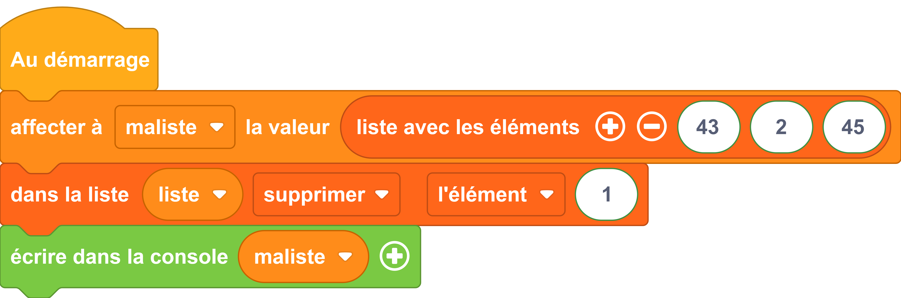

# Supprimer l'élément d'une liste

## Exemple

=== "Exemple avec des blocs"
    {: style="width:640px;"}

!!! Attention
    Vous remarquerez que le bloc de suppression
    {: style="width:640px;"}

     est une option du bloc de d'obtention.
     
    {: style="width:640px;"}

    Et celui-ci change de forme !

=== "Exemple avec du code"

    ```python
    
        from machine import *
        from thingz import *
        # creation d'une liste à trois éléments
        maliste = [43, 2, 45]
        # suppression de l'élément [1]
        liste.pop(1)
        print(str(maliste));

    ```


        


## Aller plus loin

Les opérations sur les listes sont aussi nombreuses que pratiques. Vous pourrez vous faire une idée rapide de ce qu'il est possible de faire sur le site : [python.doctor](https://python.doctor/page-apprendre-listes-list-tableaux-tableaux-liste-array-python-cours-debutant)

Si vous préférez un petit film, choisissez [les Pythonnerie sur les listes](https://www.youtube.com/watch?v=J3RJE8516MU)

Dans l'exemple ci-dessus, nous utilisons les fonctions du langage MicroPython [`#!python print()`](../communication/ecrire_dans_la_console.md) et `#!python str()`.
La fonction `#!python print()` est détaillée dans la [documentation MicroPython](https://www.micropython.fr/reference/#/03.builtin/print).

Pour en savoir plus sur la fonction `#!python str()`, nous vous invitons à lire la [documentation MicroPython](https://www.micropython.fr/reference/#/03.classes_builtins/README?id=class-str).

Nous utilisons une [boucle itérative](../boucles/boucle_iterative.md) et pour en savoir plus la aussi : la [documentation MicroPython](https://www.micropython.fr/reference/#/02.mots_cles/for_in/)