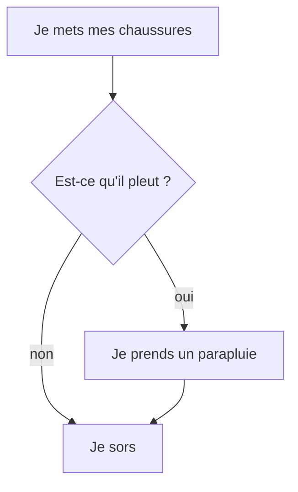

---
hide:
  - toc
---

# Exécuter des instructions si une condition est vraie ou non


Dans votre vie vous prenez des décisions et la plupart du temps votre décision dépend de conditions.


Ça peut être des conditions climatiques, s'il neige vous ne sortez pas en chemise hawaienne /short.

si l'eau est trop chaude vous fermer un peu le robinet d'eau chaude.

si il fait 17° chez vous, vous mettez un pull.

etc....

Micropython nous offre la possibilité d'avoir ce type de raisonnement dans notre programme


## Exemple 1

Dans l'exemple ci-dessous, nous allons allumer une LED RVB en rouge si le seuil de luminosité est supérieur à un certain seuil (125), sinon la LED RVB est allumée en vert.

=== ":material-puzzle: Exemple avec des blocs"
    {: style="width:380px;"}

	!!! info
    	Le bloc `#!python if` {: style="height:24px;"} peut être trouvé dans la catégorie de blocs [:fontawesome-solid-gear: Logique](#){: style="color: rgb(252,116,23); font-weight: bold;"}. Notez qu'une condition doit être fournie pour que ce bloc soit fonctionnel.


=== ":material-code-array: Exemple avec du code"

	```python

	# On boucle indéfiniment
	while True:  
		# Si le niveau de luminosité relevé par le capteur est supérieur à 125
		if led.read_light_level() > 125:
			# Alors on allume la LED RVB en rouge
			led.set_colors(255, 0, 0)
		else:
			# Sinon on allume la LED RVB en vert
			led.set_colors(0, 255, 0)
	```

	Si la partie entre `#!python if` et les `#!python :` est évaluée comme vrai
	alors les instructions sur les lignes indentées qui suivent dessous seront exécutées.
	Sinon ce sont les instructions situées après le `#!python else:` qui le seront.
	
	j'insiste sur le fait que le bloc de code executé si le `#!python if` est vrai comporte une tabulation par rapport au `#!python if` et que le `#!python else` ce retrouve tabulé au même niveau que le `#!python if` 	


## Exemple 2

Dans l'exemple ci-dessous, nous allons allumer une LED RVB,

- En Vert si le bouton A est appuyé.
- En orange si les bouton B est appuyé.
- En rouge si les boutons A et B sont appuyés.
- Eteinte si aucun des boutons est appuyé.

si on regarde organigramme 


=== ":material-puzzle: Exemple avec des blocs"
    {: style="width:380px;"}

	!!! info
    	Le bloc `#!python if` {: style="height:24px;"} peut être trouvé dans la catégorie de blocs [:fontawesome-solid-gear: Logique](#){: style="color: rgb(252,116,23); font-weight: bold;"}. Notez qu'une condition doit être fournie pour que ce bloc soit fonctionnel.


=== ":material-code-array: Exemple avec du code"

	```python
	# On boucle indéfiniment
	while True:
		# Si le niveau de luminosité relevé par le capteur est supérieur à 125
		if led.read_light_level() > 125:
			# Alors on allume la LED RVB en rouge
			led.set_colors(255, 0, 0)
		else:
			# Sinon on allume la LED RVB en vert
			led.set_colors(0, 255, 0)
	```

	Si la partie entre `#!python if` et les `#!python :` est évaluée comme vrai alors les instructions indentées qui suivent les `#!python :` seront exécutées.	Sinon ce sont les instructions situées après le `#!python else:` qui le seront.


## Aller plus loin

On a souvent l'habitude de représenter le cours du programme avec un organigramme de programmation :


Si vous voulez en savoir plus sur les organigrammes, voici une chouette page [Wikipédia](https://fr.wikipedia.org/wiki/Organigramme_de_programmation).
Dans l'exemple ci-dessus, nous utilisons les fonctions du langage MicroPython `#!python if` et `#!python else`. Pour en savoir plus, nous vous invitons à lire la [documentation MicroPython](https://www.micropython.fr/reference/02.mots_cles/if_elif_else/).

