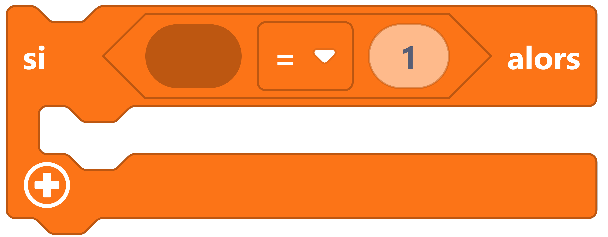
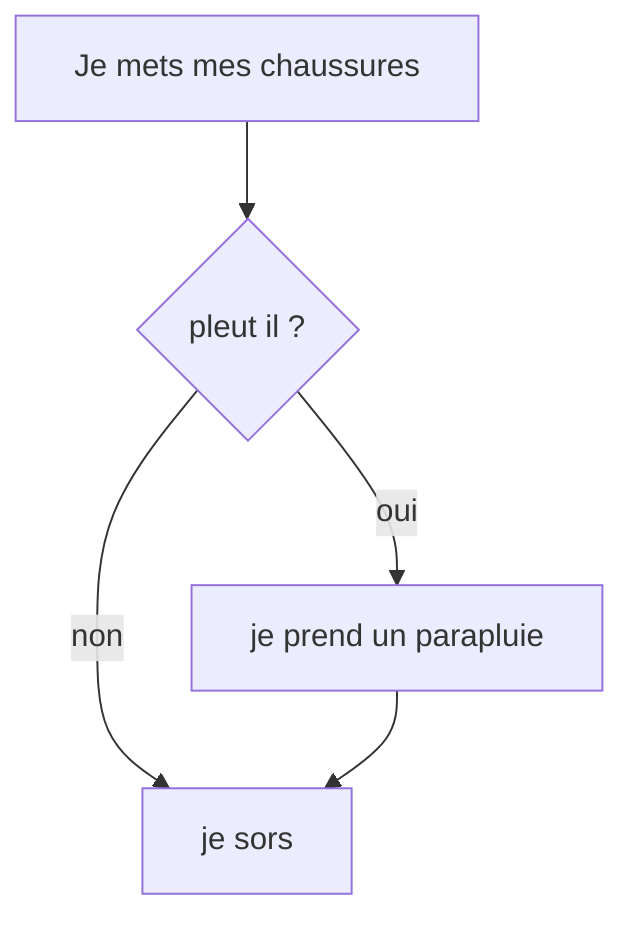

# Instruction conditionnelle

C'est une instruction qui oriente le cours du programme selon si une condition est réalisée ou non

## Exemples

=== "Exemple avec des blocs"
    
    {: style="width:380px;"}

	!!! info

    	Le bloc if {: style="height:24px;"} peut être trouvé dans la catégorie de blocs [:fontawesome-solid-gear: logique](#){: style="color: rgb(252,116,23); font-weight: bold;"}.
		
		 Notez que ce block doit être rempli au niveau de la condition pour étre fonctionel 


=== "Exemple avec du code"

	```python
	
	while True:
	if led.read_light_level() > 125:
		led.set_colors(255, 0, 0)
	else:
		led.set_colors(0, 255, 0)

	```

	Si la partie entre if et les ":"" ,  est évalué comme vrai,
	alors le block de code indenté qui suit les ":"" , sera interprété.

	Sinon ce bloc ne sera pas pris en compte,
	et le programme continuera  par le bloc de même indentation que l'instruction conditionnelle if (si).


## Aller plus loin
Dans l'exemple ci-dessus, nous utilisons les fonctions du langage MicroPython `#!python if` et `#!python else`. Pour en savoir plus, nous vous invitons à lire la [documentation MicroPython](https://www.micropython.fr/reference/02.mots_cles/if_elif_else/).

On a souvent l'habitude de représenter le cour du programme avec un organigramme de programmation 

Si vous voulez en savoir plus sur les [organigrammes](https://fr.wikipedia.org/wiki/Organigramme_de_programmation) 
