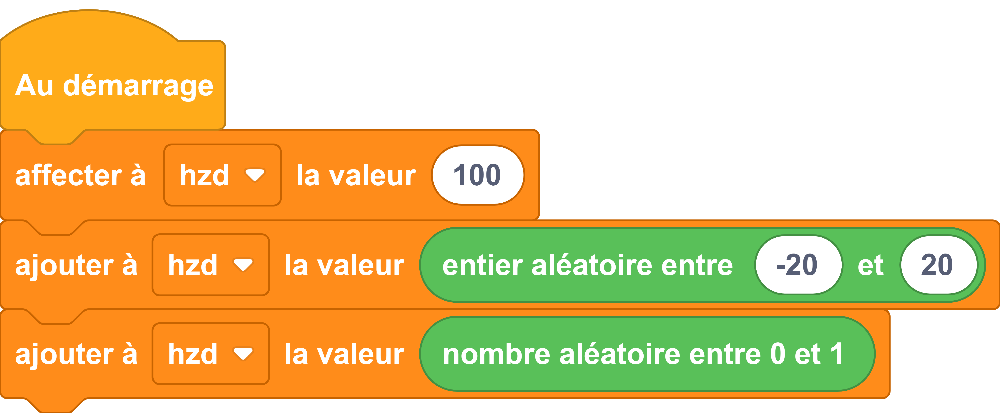

---
hide:
  - toc
---

# Générer un nombre aléatoire
Le module `#!python random` fournit des fonctions permettant de gérer le hasard.

## Exemple
=== ":material-puzzle: Exemple avec des blocs"

    {: style="width:480px;"}

=== ":material-code-array: Exemple avec du code"

    ```python
        import random

        hzd = 100
        #on ajoute a hzd un nombre entier aléatoire compris entre - 20 et + 20
        hzd = hzd + random.randint(-20, 20)
        #on ajoute a hzd un nombre aléatoire compris entre 0 et 1
        hzd = hzd + random.random()
    ```

## Aller plus loin
Dans l'exemple ci-dessus, nous utilisons le module `#!python random`.Pour en savoir plus sur ce module, nous vous invitons à lire la [documentation MicroPython](https://docs-micropython-org.translate.goog/en/latest/library/random.html?_x_tr_sl=ja&_x_tr_tl=fr&_x_tr_hl=fr&_x_tr_pto=wapp).