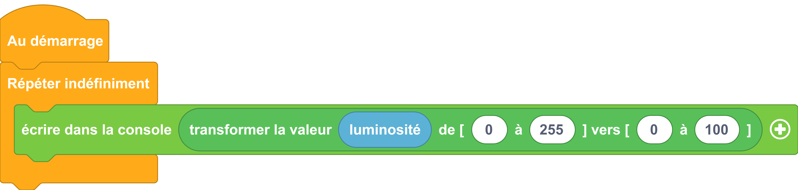

---
hide:
  - toc
---

# Convertir une valeur dans un autre intervalle
Transforme une valeur comprise dans un intervalle [min→max] dans un autre intervalle [min→max]

## Exemple

Dans l'exemple suivant, nous allons faire passer la luminosité mesurée par la Galaxia de l'intervalle [0, 255] vers l'intervalle [0→100] :

=== ":material-puzzle: Exemple avec des blocs"
    {: style="width:640px;"}

=== ":material-code-array: Exemple avec du code"

    ```python
    from machine import *
    from thingz import *
    
    # Définition d'une fonction appelée "map", ses paramètres séparés par une 
    # virgule, entre parenthèses
    def map (value, from_min, from_max, to_min, to_max):
      # Cette fonction retourne une valeur (c'est une fonction avec sortie)
      # Les variables de cette fonction ne sont valables que dans la fonction
      return (value-from_min) * (to_max-to_min) / (from_max-from_min) + to_min

    while True:
      print(round(map(led.read_light_level(), 0, 255, 0, 100), 3))
    ```
    !!! info
        On remarque que cette transformation est une formule mathématique. Chaque opérande prend la place des paramètres au sein d'une fonction. Celle-ci est définie plus haut et nommée map

## Aller plus loin
Dans l'exemple ci-dessus, nous utilisons la fonction [`#!python print()`](../communication/ecrire_dans_la_console.md) et [`#!python def`](../fonctions/fonction.md), nous avons utilisé également le module `utime` qui permet de gérer les éléments de temps.Pour en savoir plus sur ce module, nous vous invitons à lire la [documentation MicroPython](https://www.micropython.fr/reference/#/04.modules_standards/utime/00.module_time?id=module-utime).
