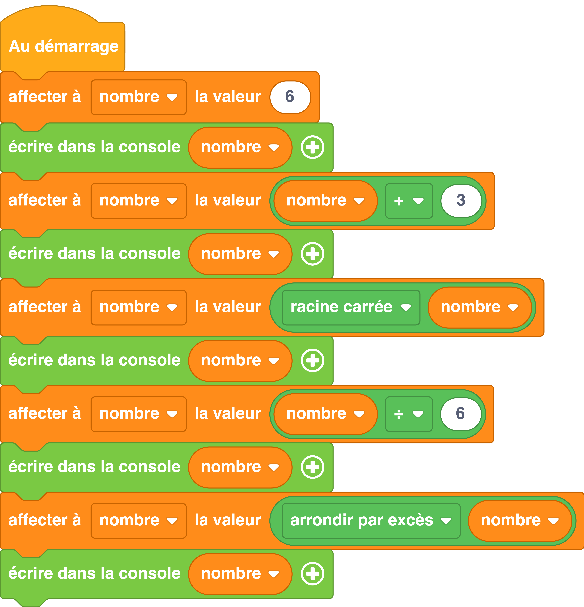

---
hide:
  - toc
---

# Manipuler des nombres
Le module `#!python math` fournit des fonctions permettant de manipuler des nombres.

## Exemple
=== ":material-puzzle: Exemple avec des blocs"

    {: style="width:480px;"}

=== ":material-code-array: Exemple avec du code"

    ```python
    import math

    # On initialise une variable appelée nombre à 6
    nombre = 6
    # La ligne suivante va afficher 6 dans la console
    print(nombre)
    nombre = nombre + 3
    # La ligne suivante va afficher 9 dans la console
    print(nombre)
    nombre = math.sqrt(nombre)
    # La ligne suivante va afficher 3 dans la console
    print(nombre)
    nombre = nombre / 6
    # La ligne suivante va afficher 0.5 dans la console
    print(nombre)
    nombre = math.ceil(nombre)
    # La ligne suivante va afficher 1 (arrondi par excès du nombre flottant 0.5)
    print(nombre)
    ```

## Aller plus loin
Dans l'exemple ci-dessus, nous utilisons le module `#!python math`.Pour en savoir plus sur ce module, nous vous invitons à lire la [documentation MicroPython](https://www.micropython.fr/reference/#/04.modules_standards/math/00.math).