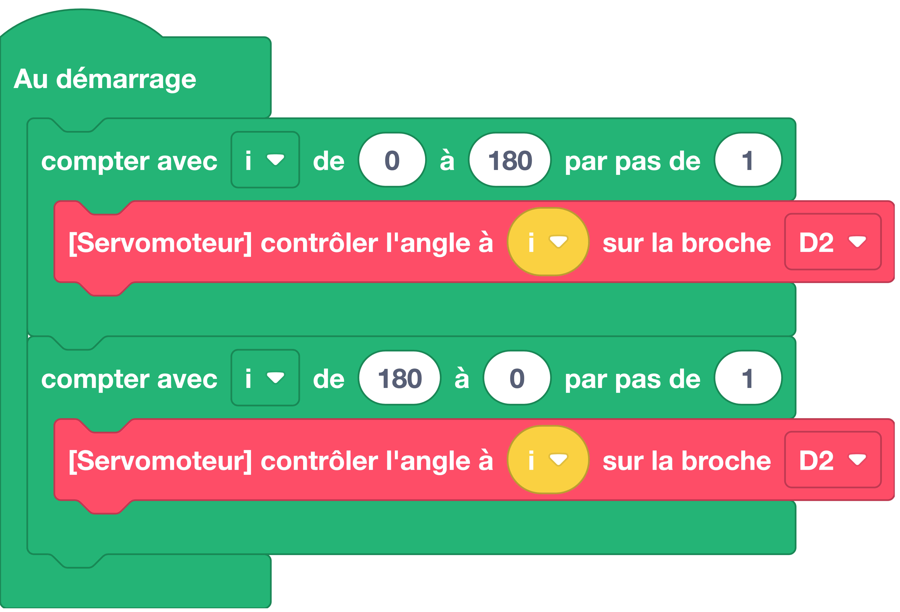

# Contrôler un servomoteur

Permet de contrôler l'angle d'un servomoteur (de 0 à 180) 0 à 180) sur les broches digitales.


## Exemple avec des blocs
{: style="width:480px;"}

## Exemple avec du code

```python
# print() fait partie du langage MicroPython
# pas besoin d'importer un module

# Affichage d'un message avec la fonction print()
print("Bonjour !")
```

## Aller plus loin
Dans l'exemple ci-dessus, nous utilisons la fonction `#!python print()` qui fait partie du langage MicroPython (donc pas besoin d'importer un module pour l'utiliser). Cette fonction peut prendre un ou plusieurs paramètres détaillés dans la [documentation MicroPython](https://www.micropython.fr/reference/03.builtin/print/).