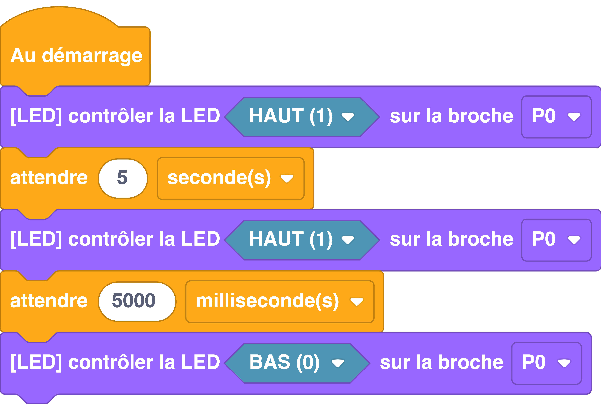

---
hide:
  - navigation
  - toc
---

# 

=== ":material-puzzle: Exemple avec des blocs"
    {: style="width:480px;"}

=== ":material-code-array: Exemple avec du code"

    ```python
    # On importe les modules
    # dont on a besoin
    from machine import *
    import utime

    # On déclare une LED sur la broche P0
    p0 = Pin(3, Pin.OUT)

    p0.on()
    utime.sleep(5)
    p0.on()
    utime.sleep_ms(5000)
    p0.off()
    ```