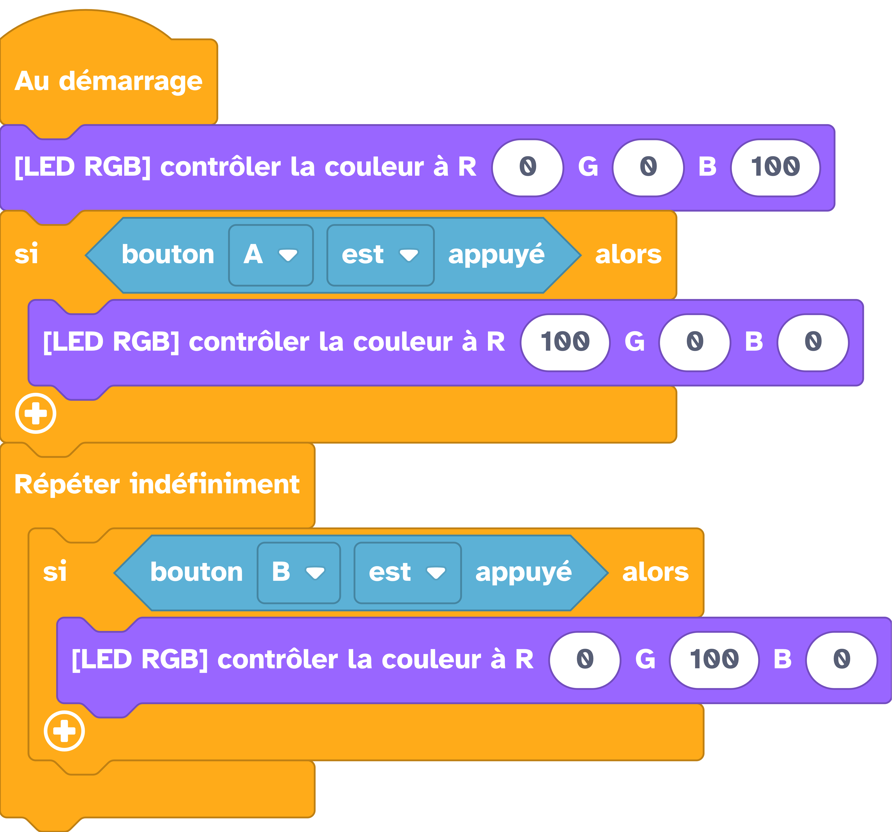

---
hide:
  - navigation
  - toc
---

# 

=== ":material-puzzle: Exemple avec des blocs"
    {: style="width:480px;"}

=== ":material-code-array: Exemple avec du code"

    ```python
    from thingz import *

    led.set_colors(0, 0, 100)
    if button_a.is_pressed():
      led.set_colors(100, 0, 0)

    while True:
      if button_b.is_pressed():
        led.set_colors(0, 100, 0)
    ```