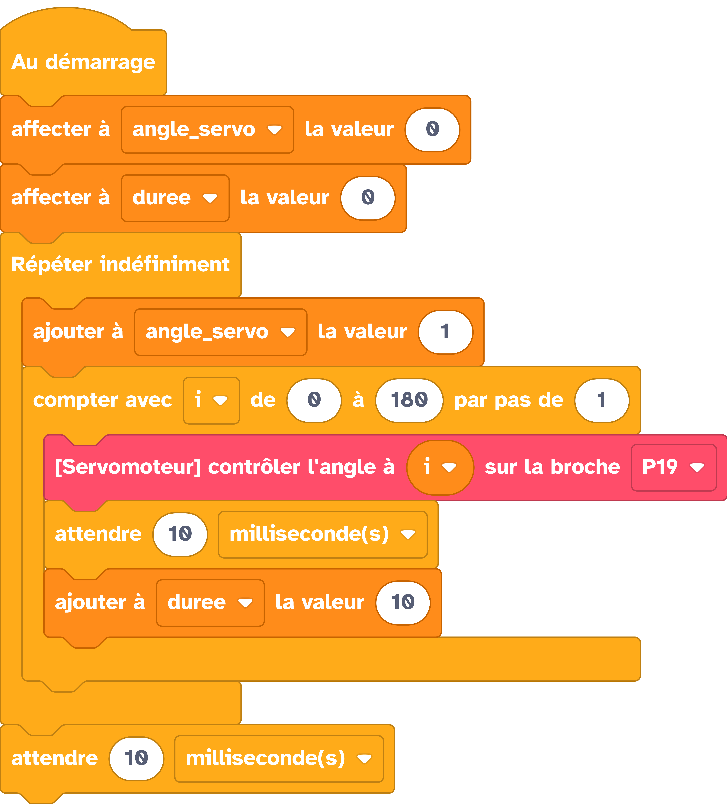

---
hide:
  - navigation
  - toc
---

# 

=== ":material-puzzle: Exemple avec des blocs"
    {: style="width:480px;"}

=== ":material-code-array: Exemple avec du code"

    ```python
    from machine import *
    from thingz import *

    liste = []
    maliste = [12, 23, 35]
    print(str(maliste[1]));

    ```