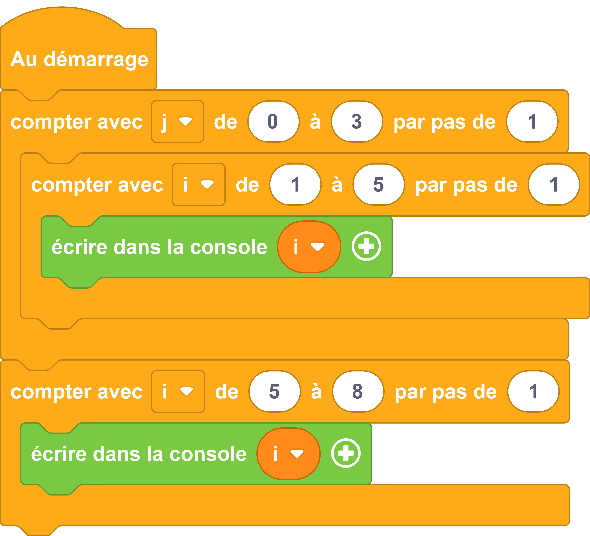

---
hide:
  - navigation
  - toc
---

# 

=== ":material-puzzle: Exemple avec des blocs"
    {: style="width:480px;"}

=== ":material-code-array: Exemple avec du code"

    ```python
    from machine import *
    from thingz import *

    for j in range(0, 3, 1):
    for i in range(1, 5, 1):
        print(str(i));
    for i in range(5, 8, 1):
    print(str(i));

    ```