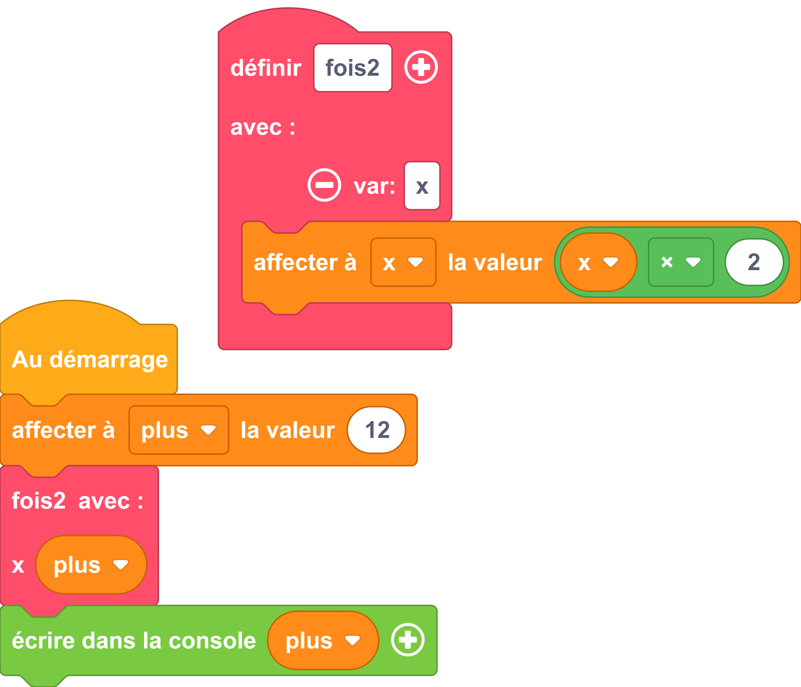

---
hide:
  - navigation
  - toc
---

# 

=== ":material-puzzle: Exemple avec des blocs"
    {: style="width:480px;"}

=== ":material-code-array: Exemple avec du code"

    ```python
    from machine import *
    from thingz import *

    def fois2(x):
    x = x * 2

    plus = 12
    fois2(plus)
    print(str(plus));

    ```