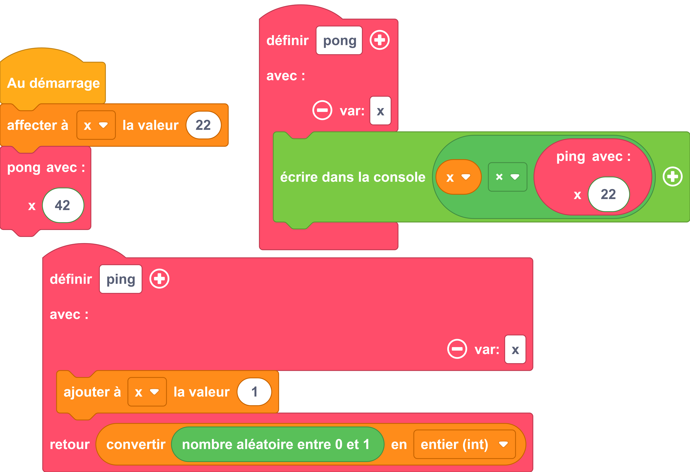

---
hide:
  - navigation
  - toc
---

# 

=== ":material-puzzle: Exemple avec des blocs"
    {: style="width:480px;"}

=== ":material-code-array: Exemple avec du code"

    ```python
        import math
        import random
       
        def pong(x):
        print(str(x * ping(22)));
        return

        def ping(x):
        x = x + 1
        return int(random.random())

        x = 22
        pong(42)
    ```