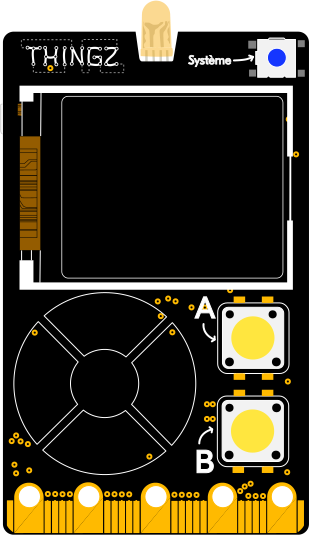

---
hide:
  - toc
---

# Envoyer des données avec une requête HTTP POST
Permet d'envoyer des données avec une requête HTTP `POST` en tant que client et de récupérer la réponse du serveur.

# Branchement
{: style="height:380px;"}

## Exemple
Dans l'exemple ci-dessous, nous allons connecter le module ESP de la Galaxia à un réseau wifi grâce au module `network` (voir l'exemple [se connecter à un réseau wifi](./connecter_wifi_station.md)) puis nous enverrons une requête HTTP `POST` à l'adresse `http://emoncms.fr/input/post` grâce au module additionnel `requests`. Le contenu de cette requête sera un [dictionnaire](../dictionnaires/dictionnaires.md) contenant la luminosité ambiante perçue par la carte [Galaxia](../galaxia.md).

```py
# On commence par importer les modules network, time et thingz
import network
import time
from thingz import *

# On importe le module additionnel requests
import requests
# On spécifie les informations du réseau wifi
# (remplacez "mon_reseau" et "mon_mot_de_passe" 
# par les informations de votre réseau)
ssid = "mon_reseau"
password = "mon_mot_de_passe"

# On vient créer une instance de l'interface wifi en mode station
sta_if = network.WLAN(network.STA_IF)

# On active l'interface wifi
sta_if.active(True)

# Et on se connecte au réseau wifi
print(f"Connexion au réseau {ssid}...", end="")
if not sta_if.isconnected():
  sta_if.connect(ssid, password)
  while not sta_if.isconnected():
    print(".", end="")
    time.sleep(1)

# On affiche que la connexion a bien été établie
print(f"\nConnecté au réseau {ssid} !")

# URL du serveur où l'on va envoyer les données
url = "https://emoncms.fr/input/post"

while True:
  # On vérifie que la connexion est toujours active
  if sta_if.isconnected():
    # On lit la luminosité ambiante de la carte Galaxia
    # et on la convertit en chaîne de caractères
    light_level = str(led.read_light_level())

    # On crée un dictionnaire contenant les données à envoyer
    data = {
      "node": "galaxia",
      "data": '{"luminosity":' + str(led.read_light_level()) + '}',
      "apikey": "<votre_clé_api>"
    }

    # On encode les données en une chaîne de caractères
    data_encoded = '&'.join(k+"="+data[k] for k in data)

    # On envoie la requête HTTP POST au serveur emoncms.fr
    r = requests.post(url, headers={"Content-Type": "application/x-www-form-urlencoded"}, data=data_encoded)

    # Si la réponse du serveur est "ok", on allume la LED en vert
    if r.text == 'ok':
      led.set_colors(0, 100, 0)
      time.sleep(0.1)
      led.set_colors(0, 0, 0)
    else:
      # Sinon, on allume la LED en rouge
      led.set_colors(100, 0, 0)
      time.sleep(0.1)
      led.set_colors(0, 0, 0)

    # On attend 10 secondes avant d'envoyer une nouvelle requête
    time.sleep(10)
```

## Aller plus loin
Dans l'exemple ci-dessus, nous utilisons [les dictionnaires](../dictionnaires/dictionnaires.md) et la fonction [`#!python str()`](https://www.micropython.fr/reference/#/03.modules_standards/str/), le module `#!python network` qui est décrit en anglais [ici](https://docs.micropython.org/en/v1.12/library/network.html#module-network) et le module additionnel `#!python requests` qui est décrit en anglais [là](https://docs.micropython.org/en/latest/esp8266/tutorial/requests.html).