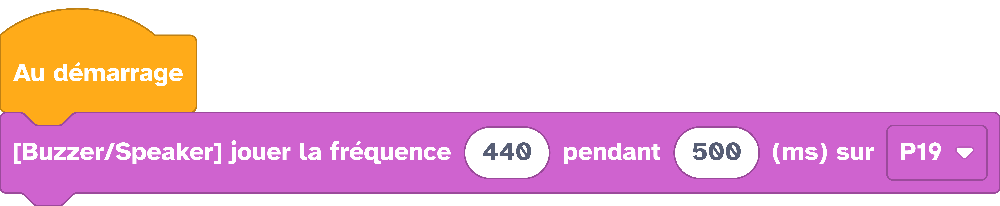

---
hide:
  - toc
---

# Jouer la fréquence

Permet de jouer une fréquence avec un module Grove buzzer.


## Branchement
{: style="height:380px;"}

## Exemple

Dans l'exemple ci-dessous, nous allons jouer la note **La** (440Hz) sur le buzzer branché sur le port `Grove 1`, broche `P19` de la Galaxia pendant 500 ms :


=== ":material-puzzle: Exemple avec des blocs"
    {: style="width:480px;"}


=== ":material-code-array: Exemple avec du code"
    ```python
    from machine import *
    import utime

    # Initialisation du buzzer sur la broche P19
    p19 = Pin(13, Pin.OUT)

    def pitch (pin, noteFrequency, noteDuration, silence_ms = 10):
    if noteFrequency is not 0:
        microsecondsPerWave = 1e6 / noteFrequency
        millisecondsPerCycle = 1000 / (microsecondsPerWave * 2)
        loopTime = noteDuration * millisecondsPerCycle
        for x in range(loopTime):
        pin.on()
        utime.sleep_us(int(microsecondsPerWave))
        pin.off()
        utime.sleep_us(int(microsecondsPerWave))
    else:
        utime.sleep_ms(noteDuration)
    utime.sleep_ms(silence_ms)

    # On joue la fréquence 440Hz pendant 500ms
    pitch(p19, 440, 500)
    ```

## Aller plus loin
Dans l'exemple ci-dessus, nous utilisons la fonction `#!python pitch()` qui permet de jouer des notes avec un buzzer. Pour aller plus loin avec le son, rendez-vous sur la [documentation Vittascience](https://fr.vittascience.com/wiki?interface=galaxia&category=actuators#actuators_playMusicGroveBuzzer).