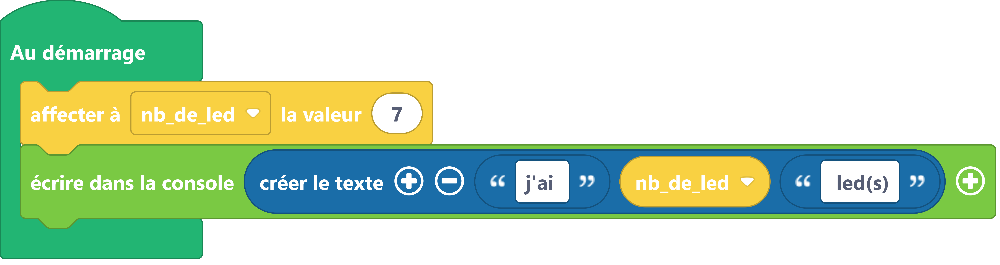

# Utiliser une variable pour y stocker des nombres
Une variable est un espace mémoire dans lequel il est possible de mettre une valeur. Par exemple, pour stocker un nombre dans une variable, je peux utiliser les instructions suivantes :


## Exemple

=== ":material-puzzle: Exemple avec des blocs"
     {: style="width:640px;"}

    !!! info
    Le bloc {: style="height:24px;"} permet d'agréger (on dit aussi concaténer) des éléments (variables, chaînes de caractères...) pour former un nouveau texte. Ce bloc peut être trouvé dans la catégorie de blocs [:fontawesome-solid-font: Texte](#){: style="color: rgb(26, 109, 168); font-weight: bold;"}.


=== ":material-code-array: Exemple avec du code"
    ```python
    #on affecte un nombre a une variable de la façon suivante
    nb_de_led = 7
    #pour que la valeur de la variable soit pris en compte dans la fonction print
    #remarquer l'absence de guillemet
    print("j'ai ",nb_de_led," led(s)");

    ```

## Aller plus loin
Dans l'exemple ci-dessus, nous utilisons la fonction `#!python print()` qui fait partie du langage MicroPython (donc pas besoin d'importer un module pour l'utiliser). Cette fonction peut prendre un ou plusieurs paramètres détaillés dans la [documentation MicroPython](https://www.micropython.fr/reference/03.builtin/print/).