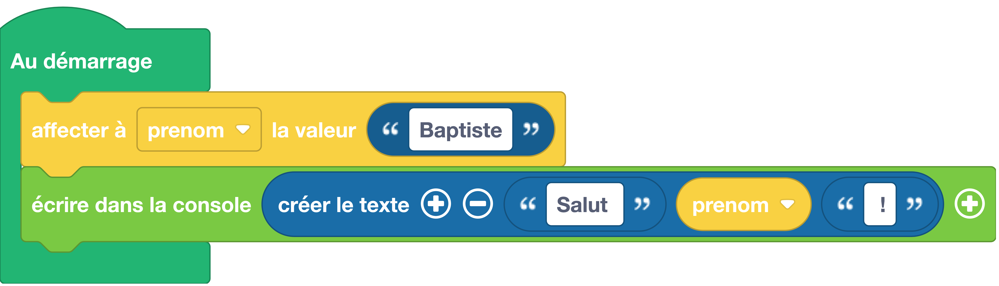

# Utiliser une variable pour y stocker du texte
Une variable est un espace mémoire dans lequel il est possible de mettre une valeur. Par exemple, pour stocker un prénom (qui est un texte) dans une variable, je peux utiliser les instructions suivantes :


## Exemple avec des blocs
{: style="width:640px;"}

!!! info
    Le bloc {: style="height:24px;"} permet d'agréger (on dit aussi concaténer) des éléments (variables, chaînes de caractères...) pour former un nouveau texte. Ce bloc peut être trouvé dans la catégorie de blocs [:fontawesome-solid-font: Texte](#){: style="color: rgb(26, 109, 168); font-weight: bold;"}.

## Exemple avec du code

```python
# prenom est le nom de ma variable
# "Baptiste" est une chaîne de caractères, notez bien les guillemets
# le signe '=' va stocker la chaîne de caractères dans la variable prenom 
prenom = "Baptiste"
print("Salut ", prenom, " !");
```

## Aller plus loin
Dans l'exemple ci-dessus, nous utilisons la fonction `#!python print()` qui fait partie du langage MicroPython (donc pas besoin d'importer un module pour l'utiliser). Cette fonction peut prendre un ou plusieurs paramètres détaillés dans la [documentation MicroPython](https://www.micropython.fr/reference/03.builtin/print/).